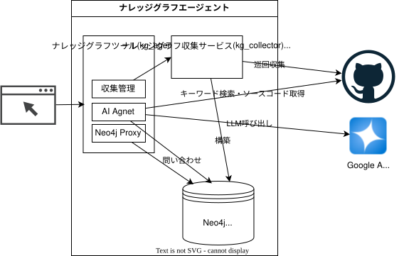

# ナレッジグラフエージェント

ナレッジグラフエージェントは Github の組織配下のリポジトリからナレッジグラフを構築し、これを使ったAIエージェントを提供するものである。ユーザはナレッジグラフに Cypher という言語で直接問い合わせることもできる。ソースコードの解析には Tree-sitter を利用し、ナレッジグラフデータベースには Neo4j を使用している。LLMには Google AI Platform(旧 Vertex AI)を使用している。



# ナレッジグラフとは

プログラミングやソフトウェア開発におけるナレッジグラフとは、ソースコード、ライブラリ、設計書、変更履歴、バグ報告などの開発に関わる情報を「要素（ノード）」と「関係性（エッジ）」のネットワーク構造として整理・データベース化したものである。

従来のテキスト検索や静的解析ツールでは見落としがちな「コードとシステム全体の複雑なつながり」をグラフ構造で表現することで、開発の精度と効率を高める。

## ナレッジグラフの構成例

ノード（要素）: 関数、クラス、ファイル、依存ライブラリ、コミット履歴、Issue（課題）、開発者

エッジ（関係性）: 「〜を呼び出す（calls）」「〜を継承する（inherits）」「〜に依存する（depends_on）」「〜のバグを修正する（fixes）」「〜が作成した（authored_by）」

## ナレッジグラフによってプログラミング品質が上がる理由

### 影響範囲の正確な把握（破壊的変更の防止）
コードの一部を修正した際、その変更がどの関数、テストコード、外部API、あるいは別サービスにまで影響するかを網羅的に追跡できる。デプロイ後の予期せぬバグ（エンバグ）を劇的に減らせる。

### コード生成AI（LLM）の精度向上（Graph RAG）
GitHub CopilotやCursorなどのコード生成AIにナレッジグラフの構造情報を与えることで、単一のファイル内だけでなく「プロジェクト全体の設計規約や依存関係」を理解した精度の高いコードを提案させることが可能になる。

### アーキテクチャ違反・循環依存の検知
「上位レイヤーが下位レイヤーを正しく呼び出しているか」「コード間で不適切な循環依存が発生していないか」といった設計上の欠陥（コードスメル）を自動的に検出・リファクタリングできる。

### ノウハウの再利用と属人化の解消
「過去に似た機能を誰がどのように実装し、どんな不具合が発生してどう修正されたか」をコードと課題管理システムを紐付けて検索できるため、過去の失敗の再発を防ぎ、共通処理の重複実装を回避できる。

# ナレッジグラフの生成手順

GitHubの多数のリポジトリからナレッジグラフを構築するには、「データ収集（GitHub API/コード解析）」「グラフモデル定義」「グラフデータベース（Neo4j等）への保存」を行うパイプラインを作成する。

---

**ステップ1: データの抽出・解析**

複数リポジトリから3つのレイヤーのデータを並列取得する。

* **GitHubメタデータの取得（GitHub GraphQL API）**
* 各リポジトリのコミット履歴、プルリクエスト、Issue、コントリビューター（開発者）情報を取得する。


* **コード構造の構文解析（AST / LSP解析）**
* **Tree-sitter** を使用し、ソースコードから関数、クラス、変数、インポート文、および呼び出し関係（Call Graph）をパースする。


* **リポジトリ間の依存関係の取得**
* 各リポジトリの `package.json`、`pyproject.toml`、`pom.xml` や GitHub Dependency Graph API から、リポジトリ同士や外部ライブラリとの依存関係を抽出する。


---

**ステップ2: グラフモデル（ノードとエッジ）の設計**

抽出したデータを「要素（ノード）」と「関係（エッジ）」として整理する。

* **ノードの種類**
* `Repository`（リポジトリ）
* `File`（ファイル）
* `Function`（関数） / `Class`（クラス）
* `Commit`（コミット） / `Issue`（課題）
* `User`（開発者）


* **エッジ（関係性）の種類**
* `(:Repository)-[:CONTAINS]->(:File)`
* `(:File)-[:DEFINES]->(:Function)`
* `(:File)-[:IMPORTS]->(:File)`
* `(:Function)-[:CALLS]->(:Function)` （クロスリポジトリ含む）
* `(:Function)-[:REFERENCES]->(:Function)` （コールバックやJSX propsとしての参照）
* `(:User)-[:AUTHORED]->(:Commit)-[:MODIFIED]->(:File)`
* `(:Commit)-[:FIXES]->(:Issue)`
* `(:Repository)-[:DEPENDS_ON]->(:Repository)`


---

**ステップ3: グラフデータベースへの登録**

抽出・変換したデータを **Neo4j** のグラフデータベースへ投入する。

たとえば、Python等で解析したデータを Cypher クエリ言語を使って登録する。

```cypher
// リポジトリ・ファイル・関数のノード作成と関連付け
MERGE (r:Repository {name: "payment-service"})
MERGE (f:File {path: "src/charge.py", repo: "payment-service"})
MERGE (fn1:Function {name: "process_payment", repo: "payment-service"})

MERGE (r)-[:CONTAINS]->(f)
MERGE (f)-[:DEFINES]->(fn1)

// 他リポジトリの共通ライブラリ関数呼び出しの記録
MERGE (fn2:Function {name: "validate_card", repo: "auth-library"})
MERGE (fn1)-[:CALLS]->(fn2)

```

---

**ステップ4: 活用（検索・分析）**

構築したナレッジグラフに対してクエリを発行し、品質向上に役立てる。

* **マルチリポジトリ影響範囲分析**
特定ライブラリの関数に変更を加える際、影響を受ける全リポジトリの関数を特定する。
```cypher
MATCH (target:Function {name: "validate_card"})<-[:CALLS*1..3]-(caller:Function)<-[:DEFINES]-(f:File)<-[:CONTAINS]-(r:Repository)
RETURN r.name, f.path, caller.name

```


* **AI・LLM連携（GraphRAG）**
Vertex AI と接続し、「リポジトリAの変更がリポジトリBにどう影響するか」といった複数コードベースにまたがる回答精度を高める。

# 対象のリポジトリ

対象のGitHub Organizationは環境変数 `GH_TARGET_ORGANIZATION` で指定する。
収集するリポジトリ名は環境変数 `TARGET_REPOSITORY_GLOB` で絞り込める。値には `wcmatch` の拡張GLOBを指定し、例えば `delivery-*` なら名前が `delivery-` で始まるリポジトリだけを収集する。未指定または空の場合は、Organization内のすべてのリポジトリを対象とする。
環境変数は `docker compose up` を実行するシェルで設定し、値を変更した場合は `kg-collector` コンテナを再作成する。フィルタは収集対象とWeb UIの一覧に適用されるが、Neo4jへ保存済みの非該当リポジトリは削除しない。

# GitHubの認証情報

`GH_PAT` には、対象Organizationのリポジトリに対して actions、code、issues、metadata、pull requestsを参照できるPATを設定する。`GH_PAT` と `GH_TARGET_ORGANIZATION` はイメージへ組み込まず、コンテナ起動時にホストの環境変数を継承させる。

GHCRへのログインには `GITHUB_TOKEN` を使用する。トークンには、プッシュ先パッケージに対する書き込み権限が必要となる。

# 構成

`docker-compose.yml` で次の3サービスを起動する。

* `neo4j`: ナレッジグラフを永続化する。
* `kg-collector`: GitHub API、Tree-sitter、Manifest解析を実行し、収集ジョブと参照用のHTTP APIを提供する。Web UIは持たない。
* `kg-agent`: React SPAをPythonサーバで配信し、`kg-collector` APIへのプロキシとAIチャットAPIを提供する。

`kg-collector` は抽出した情報をYAMLファイルへ保存せず、最初からNeo4jへノードとエッジとして登録する。TypeScript/TSX の相対 import、拡張子省略、ディレクトリの `index`、`tsconfig.json` / `jsconfig.json` の `baseUrl` と `paths` をリポジトリ内の実在ファイルへ解決し、`IMPORTS` エッジとして保存する。外部npmパッケージはファイルへ解決せず、Manifestの依存関係として扱う。`kg-agent` の画面状態はブラウザヒストリで管理され、リポジトリ詳細URLやチャットURLへ直接アクセスできる。AIチャットは質問中の関数をNeo4jで照合し、逆向きの `CALLS` 関係を最大5段検索した結果をVertex AIへ渡して回答を生成する。認証機能は設けていない。

Neo4j のデータは Docker の named volume `neo4j-data` を `/data` にマウントして永続化する。

devcontainerはDocker-in-Dockerを提供する。devcontainerをrebuildしたあと、内部から `docker compose` を実行できる。

## ステップ1〜3収集ツール

`kg-collect` は `GH_PAT` を使って `GH_TARGET_ORGANIZATION` のリポジトリを列挙し、次の情報を並列収集する。

* GitHub GraphQL API: リポジトリ、直近のコミット、Pull Request、Issue、コミット作成者
* Tree-sitter: 関数、クラス、変数、import、関数内の呼び出し
* Manifest: `package.json`、`pyproject.toml`、`pom.xml` の依存関係

収集結果はNeo4jへ次のように登録する。

* `Repository`, `File`, `Function`, `Class`, `Commit`, `PullRequest`, `Issue`, `User`, `Manifest`, `Dependency` ノードを作成する。
* `CONTAINS`, `DEFINES`, `IMPORTS`, `CALLS`, `REFERENCES`, `HAS_COMMIT`, `HAS_PULL_REQUEST`, `HAS_ISSUE`, `AUTHORED`, `HAS_MANIFEST`, `DECLARES`, `DEPENDS_ON`, `FIXES` エッジを作成する。
* `updatedAt`, `pushedAt`, デフォルトブランチの先頭コミットOIDが一致するリポジトリはcloneと解析を省略し、変更されたリポジトリだけを置き換える。

### docker compose による起動

ホスト側で環境変数を設定する。`NEO4J_PASSWORD` を省略した場合は `kgpassword` を使う。

```bash
export GH_PAT=<read-only PAT>
export GH_TARGET_ORGANIZATION=<organization>
export TARGET_REPOSITORY_GLOB='delivery-*'
export NEO4J_PASSWORD=<neo4j password>
export GCP_SA_KEY_JSON="$(cat /path/to/service-account.json)"
```

サービスアカウントには対象Google Cloudプロジェクトの `Vertex AI ユーザー`（`roles/aiplatform.user`）ロールを付与し、Vertex AI APIを有効化する。認証JSONはファイルやイメージへ保存せず、`GCP_SA_KEY_JSON` からコンテナ起動時に渡す。プロジェクトIDは認証JSONの `project_id` を使用するが、別プロジェクトを利用する場合は `GCP_PROJECT_ID` で上書きできる。

モデルとリージョンは必要に応じて変更できる。

```bash
export GCP_LOCATION=asia-northeast1
export GCP_MODEL=gemini-2.5-flash
export GRAPHRAG_MAX_ITERATIONS=5
export GRAPHRAG_MAX_RESULTS=100
export GRAPHRAG_MAX_GITHUB_FILES=10
export GRAPHRAG_MAX_GITHUB_FILE_BYTES=200000
export GRAPHRAG_MAX_OUTPUT_TOKENS=8192
export GRAPHRAG_MAX_OUTPUT_CHUNKS=8
```

AIチャットは質問を複数の検索語へ分解し、Neo4jで構造を検索する。ソース本文にしかない識別子、文字列、設定キー、エラーメッセージなどを調べる必要がある場合は、`GH_PAT` 認証でGitHub REST APIのCode Searchも実行する。Neo4jまたはCode Searchで見つけたファイルをGitHub Contents APIから取得して内容を調べ、未調査の論点がなくなるまで検索と再計画を繰り返す。探索は `GRAPHRAG_MAX_ITERATIONS` 回、累計 `GRAPHRAG_MAX_RESULTS` 件のいずれかへ到達した時点でも停止する。GitHubから取得するファイルは検索方法を問わず `GRAPHRAG_MAX_GITHUB_FILES` 件まで、各ファイルは `GRAPHRAG_MAX_GITHUB_FILE_BYTES` バイトまでとする。画面には現在の反復回数、検索語、グラフ取得件数、ソース取得件数、回答生成状態を表示する。

回答はMarkdownとして表示する。Vertex AIが出力上限で応答を終了した場合は、1回あたり `GRAPHRAG_MAX_OUTPUT_TOKENS` トークン、最大 `GRAPHRAG_MAX_OUTPUT_CHUNKS` 回まで続きを取得して連結する。

Neo4j、収集API、kg-agent Web UIを起動する。

```bash
docker compose up --build
```

Codespaces の Ports ビューでは通常 `8080` だけを転送して利用する。その他のポートは、各サービスへ直接接続してデバッグする場合に限り転送する。

* `8080`: kg-agent のWeb UI
* `8081`: kg-collector のAPI（直接デバッグ用）
* `7474`: Neo4j HTTP API（直接デバッグ用）
* `7687`: Neo4j Bolt接続（直接デバッグ用）

Codespaces の Ports ビューで `8080` を開いて kg-agent を利用する。収集管理画面では収集状況と対象リポジトリを確認し、収集をバックグラウンドで開始できる。リポジトリ詳細には先頭コミットID、最終コミット日時、ノード数、Call Graphを表示する。AIチャット画面では「`repository-a` の `process_order` を変更した際の影響範囲は？」のように質問でき、回答とNeo4j上の根拠を確認できる。

AIチャットの履歴はブラウザのローカルストレージに保存され、ページを再読み込みしても復元される。後続の質問では直近20件の会話をコンテキストとして使用する。履歴とコンテキストはAIチャット画面の「チャットをクリア」ボタンで削除できる。

`kg-collector` は次の認証なしAPIを提供する。

* `POST /api/collect`: 収集ジョブを開始する。
* `GET /api/status`: 収集状況をServer-Sent Eventsで配信する。
* `GET /api/repositories`: 収集済みリポジトリの一覧を返す。
* `GET /api/repositories/{name}`: リポジトリ情報とノード数を返す。
* `GET /api/graph/{name}`: Call Graphを返す。

GitHub GraphQL APIの1回の取得上限に合わせ、コミット、Pull Request、Issueはそれぞれ直近100件を保存する。件数は `kg-collector` コンテナ内で `kg-collect --history-limit 20` のように指定して変更できる。

### Neo4j の確認

Neo4j Browser は kg-agent Web UI のサイドバーから開く。接続先は自動設定される。手動で接続する場合、Codespacesでは `bolt+s://<8080番の転送URLのホスト名>:443`、ローカルでは `bolt://localhost:8080` を指定する。ユーザー名は `neo4j`、パスワードは `NEO4J_PASSWORD` で指定した値を使用する。Codespacesで転送が必要なポートは `8080` のみで、`7474` と `7687` をブラウザ向けに転送する必要はない。

登録状況はCypherで確認できる。

```cypher
MATCH (r:Repository)
RETURN r.full_name, r.source_files, r.functions, r.dependencies
ORDER BY r.full_name
```

関数呼び出しの影響範囲は次のように検索できる。

```cypher
MATCH (target:Function {name: "validate_card"})<-[:CALLS*1..3]-(caller:Function)<-[:DEFINES]-(f:File)<-[:CONTAINS]-(r:Repository)
RETURN r.full_name, f.path, caller.name
```

### 差分更新

再度「ナレッジグラフ収集」を実行すると、Neo4j上の `Repository` ノードとGitHub上のリポジトリ情報を比較する。`updatedAt`、`pushedAt`、デフォルトブランチの先頭コミットOIDが一致するリポジトリはcloneと解析を省略し、変更されたリポジトリだけを置き換える。

Neo4jのデータを破棄して作り直す場合は、サービスと named volume を削除する。

```bash
docker compose down --volumes
```

途中で一部リポジトリの取得に失敗した場合も、収集ステータスにエラーを記録して残りの収集を継続する。生成前に対象リポジトリの古いノードを置き換えるため、削除されたソースの解析結果は残らない。

開発時のテストは次のコマンドで実行する。

```bash
python -m pip install -e '.[dev]'
python -m pytest -q
```

React SPAだけを開発する場合は `src/kg_agent` ディレクトリで `npm install` と `npm run dev` を実行する。本番用SPAは `kg-agent` イメージのビルド時に生成される。
